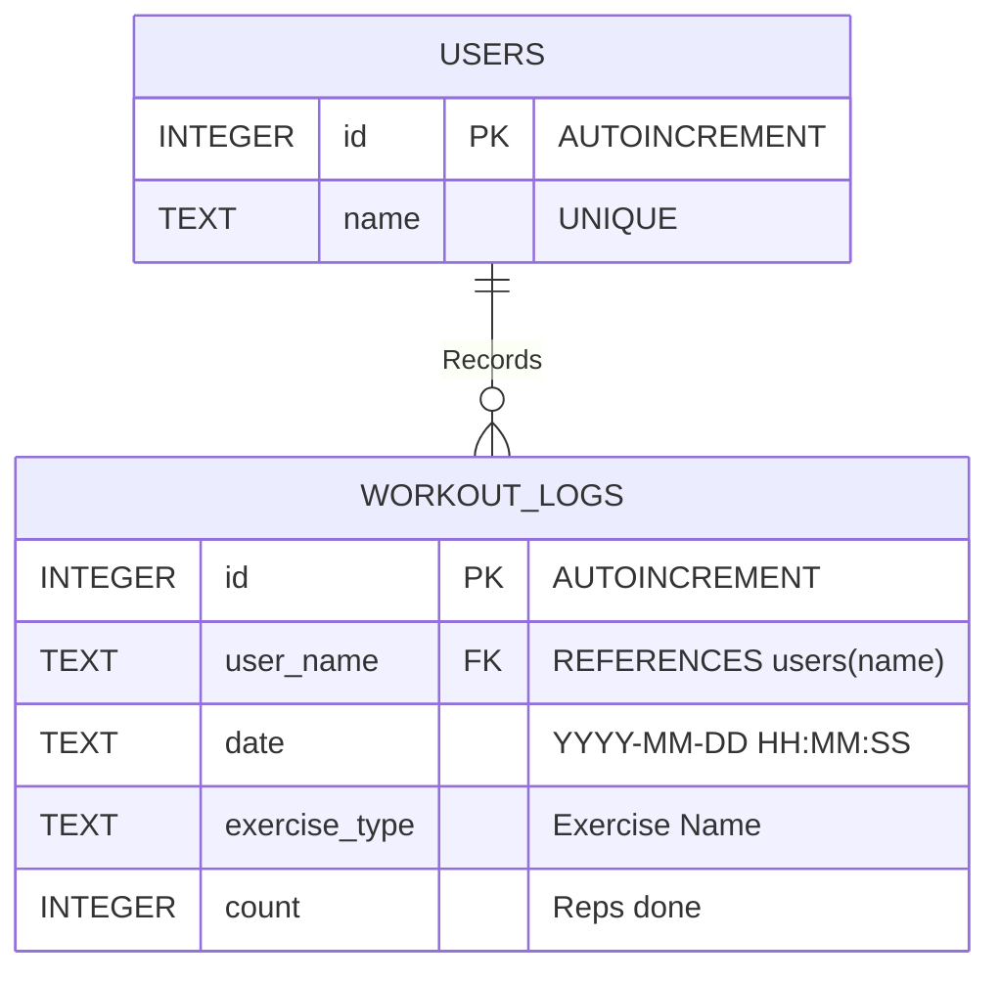

> **"웹캠과 목소리만으로 완벽한 운동 환경을 구축하다."**
AirTouchPT는 3D 비전 인공지능과 자연어 처리(NLP)를 결합하여, 화면 터치나 별도 장비 없이 실시간 자세 교정과 자동 카운팅을 제공하는 핸즈프리(Hands-free) AI 퍼스널 트레이너입니다.
> 

### 📌 Project Overview

- **프로젝트명:** AirTouchPT (Custom AI PT Master)
- **개발 인원:** 1인 (개인 프로젝트)
- **핵심 기술:** `Python`, `OpenCV`, `MediaPipe(3D Vision)`, `Scikit-learn(RandomForest)`, `SQLite`, `SpeechRecognition(NLP)`, `gTTS`
- **목표:** 기구 조작 없이 오직 '움직임'과 '목소리'만으로 구동되는 지능형 홈트레이닝 환경 구축

---

## 🏛️ System Architecture

전체 시스템은 비전 인식, 음성 제어, 이중 검증 로직, 그리고 데이터 저장소로 완벽하게 분리되어 유기적으로 동작합니다.

---

## 🌟 Key Features

### 1. 8대 운동 정밀 추론 (2D & 3D 하이브리드 파이프라인)

- **지원 종목:** 스쿼트, 푸시업, 레그레이즈, 풀업, 싯업, 바벨컬, 해머컬, 사이드 레터럴 레이즈
- **3D 공간 인식:** 카메라 왜곡을 방지하기 위해 골반 중심의 3D 절대 좌표계(`pose_world_landmarks`)를 적용하여 입체적인 공간감을 확보했습니다.
- **이중 잠금장치 (Angle Guard):** ML 모델(RandomForest)의 추론 결과와 삼각함수로 도출한 **실제 관절의 물리적 굽힘 각도를 교차 검증**하여, 꼼수 동작을 원천 차단했습니다.

### 2. 생체 역학(Biomechanics) 기반 실시간 자세 교정 AI

- **동적 임계값 추적:** 스쿼트 하강 시 무릎 간격을 기억해두고, 상승 시 간격이 55% 이하로 좁아지면 십자인대 부상 위험(Knee Valgus)을 즉각 경고합니다.
- **비대칭 보상 작용 감지:** 풀업 및 사레레 동작 시 양쪽 어깨와 손목의 Y축(높낮이) 좌표를 비교해 승모근의 과도한 개입이나 짝짝이 동작을 실시간으로 교정합니다.

### 3. 스마트 DB 및 NLP 기반 Voice Control

- **퍼지 매칭(Fuzzy Matching):** 운동 중 숨이 차서 발음이 부정확해도, 형태소 유사도 분석을 통해 사용자의 의도를 정확히 파악하여 시스템을 제어합니다.
- **경량 로컬 DB (SQLite):** 외부 서버 의존 없이 엣지(Edge) 환경에서 즉각 구동되며, 세션 데이터를 기록하고 실시간 누적 통계를 대시보드에 렌더링합니다.

---

## 🛠️ Troubleshooting (문제 해결)

### 🚨 1. 외부 데이터셋 적용 실패 및 인식률 저하

- **Problem:** 초기 개발 속도를 높이기 위해 Kaggle의 오픈소스 운동 데이터(CSV)를 적용했으나, 랜드마크 추출 기준과 체형 비율 차이로 심각한 오인식 발생.
- **Solution:** 외부 데이터를 과감히 폐기. 웹캠과 자체 캡처 모듈(mss)을 활용해 **시스템에 100% 호환되는 맞춤형 3D 데이터를 직접 수집하고 파이프라인을 독자 구축**하여 인식률을 100%로 끌어올림.

### 🚨 2. AI의 2D 픽셀 좌표 과적합 (형태가 아닌 위치를 학습)

- **Problem:** 사용자가 웹캠 앞에 서 있기만 해도 화면 내 특정 픽셀 위치를 정답으로 인식해 카운트가 올라가는 현상 발생.
- **Solution:** 학습 데이터를 2D에서 **3D 절대 좌표계**로 전면 교체. 또한, 물리적으로 관절이 특정 각도 이상 접히고 펴지지 않으면 ML의 예측을 기각하는 **이중 잠금장치(Angle Guard)** 로직을 수학적으로 구현해 꼼수 원천 차단.

### 🚨 3. STT(음성 인식)와 TTS(음성 출력)의 스레드 충돌

- **Problem:** 사용자가 음성 명령을 내릴 때, 스피커에서 나오는 AI의 자세 교정 멘트가 마이크로 다시 유입되어 심각한 오인식 발생.
- **Solution:** 음성 명령 키 입력 시, 재생 중인 스피커 오디오 스레드와 대기열(Queue)을 즉시 강제 종료하는 **'Mute 방어막' 아키텍처**를 적용하여 원활한 양방향 UX 보장.

---

## 🗄️ Database Architecture (SQLite)

초기 프로토타입 단계에서 불필요한 서버 리소스를 줄이고 이식성(Portability)을 극대화하기 위해 서버리스 관계형 데이터베이스인 SQLite를 채택했습니다.

코드 스니펫

---

## 🎯 프로젝트 목표 달성도 및 향후 계획

### **목표 대비 달성도 : 60%**

다양한 기구 운동을 포함하여 미세한 근육 움직임까지 분석하는 완벽한 AI 트레이너 구현을 초기 목표로 설정했습니다. 현재 8가지 맨몸/소도구 운동에 대한 뼈대 인식과 굵직한(Macro) 형태의 자세 교정 피드백 시스템을 성공적으로 구축했으나, 당초 예상보다 종목 수가 적고 미세 교정 로직이 부족하여 60%로 산정했습니다.

### **Phase 2. 향후 고도화 계획 (나머지 40%)**

1. **3D 공간 기하학 연산 고도화:** 벡터 내적/외적 공식을 도입해 척추의 비대칭 회전 등 정밀한 자세 교정 로직 추가.
2. **Web SaaS 플랫폼 전환:** 현재의 파이썬 로컬 PC 시스템을 **Flask + WebSockets** 아키텍처로 리팩토링하여, 별도 설치 없이 스마트폰 브라우저만으로 접근 가능한 웹 서비스로 확장할 예정입니다.

---

## 🌱  자기평가

1. **문제 해결의 본질 체득 (Data > Algorithm)**
단순히 코드를 수정하는 것을 넘어, "왜 가만히 있는데 카운트가 오를까?"를 심도 있게 분석했습니다. 이 과정에서 머신러닝의 정확도는 알고리즘의 형태보다 '데이터의 질(Quality)과 기준 좌표계의 설정'이 결과를 좌우한다는 실무적 깨달음을 얻었습니다.
2. **시스템 파이프라인 설계 역량 강화**
센서(카메라) 입력을 받아 전처리하고, AI로 추론한 뒤, 물리적 각도 계산(로직)으로 한 번 더 검증하고, 스피커와 DB(출력)로 데이터를 내보내는 전체 사이클을 직접 설계했습니다. 이 경험은 하드웨어와 소프트웨어를 최적화해야 하는 엔지니어로서의 아키텍처 설계 능력을 크게 성장시켰습니다.
3. **AI와의 '페어 프로그래밍(Pair Programming)' 진화**
AI 챗봇을 단순한 '코드 자판기'로 쓰지 않고, 데이터 호환 문제나 오디오 스레드 충돌 같은 논리적 난관을 돌파하기 위한 아키텍처 파트너로 활용했습니다. 개발자의 진정한 무기는 단순 코딩이 아니라 **명확한 질문을 던지고 시스템의 구조적 흐름을 기획하는 설계 역량**임을 깊이 체감했습니다.
